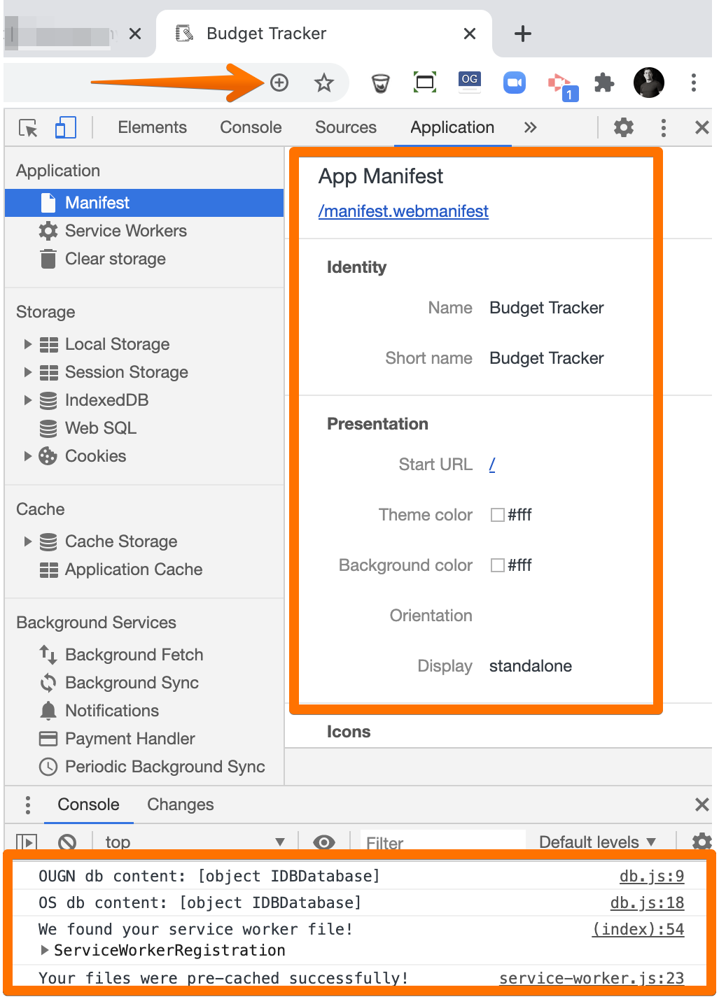

# unit-18-pwa-online_offline-budget-trackers

[View Deployed App on Heroku](https://obscure-stream-80597.herokuapp.com/)

## Objective
The goal was to add indexDB and PWA capabilities to an existing app. These features allows the site to be operational (temporarily store data) when it goes offline and to be downloaded onto a computer/mobile device.

---

## Notes

* **db.js** in the **public** folder houses the indexDB logic. Most of this code was pulled from a previous project, so I have added additional descriptive notes to help learn the functionality.

* As a PWA, this site can be downloaded to the desktop or mobile device like a regular app. 

---

## IndexDB Demo

Because of indexDB, the user's input is stored locally if the database connection is lost. Once the database comes back online, the local data resubmits to MongoDB and removes from indexDB. 

1. **In a regular use-case, the server is online, the site accepts a value and then sends it to MongoDB.**

2. **If the server connection breaks the data is then stored locally in indexDB.**

3. **Once the server connection is reestablished the data in indexDB is removed and sent to the MondoDB database.**

